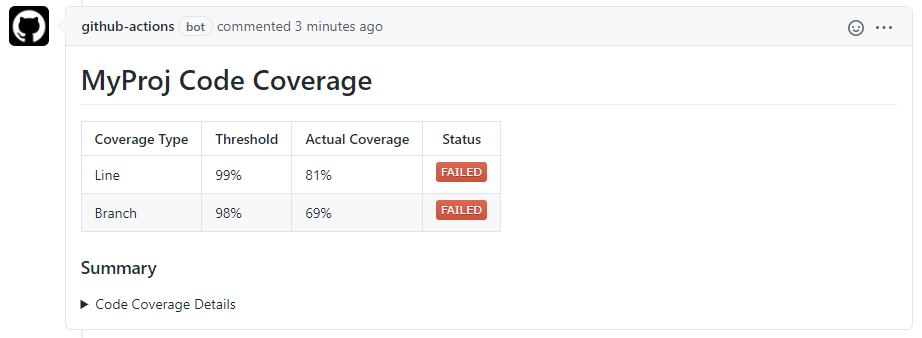
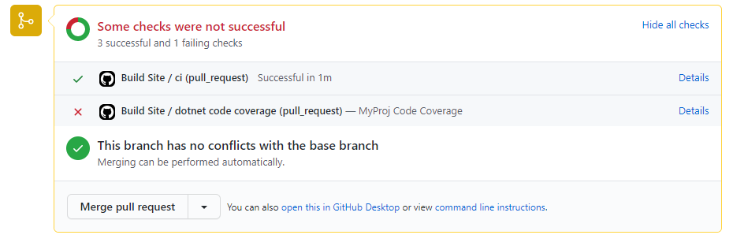
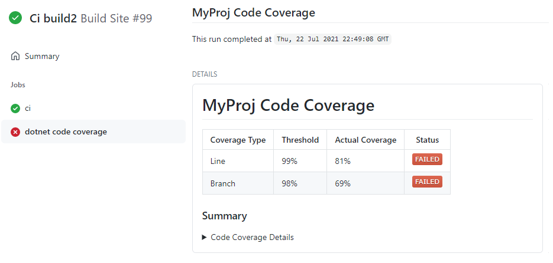
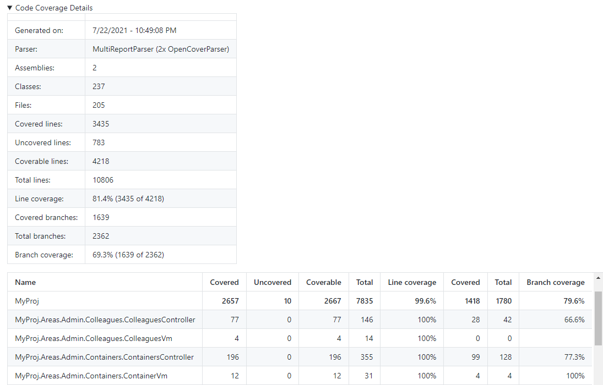

# process-code-coverage-summary

This action works in conjunction with [im-open/code-coverage-report-generator].  If a `Summary.md` file is created in the report generator action by including `MarkdownSummary` in the `reporttypes` input, this action will take the contents of that file and create a Status Check or PR Comment depending on the flags set.  This action does not create code coverage reports and it only processes one summary report at a time.

## Index

- [Thresholds](#thresholds)
- [Limitations](#limitations)
- [Action Outputs](#action-outputs)
  - [Pull Request Comment](#pull-request-comment)
  - [Pull Request Status Check](#pull-request-status-check)
  - [Workflow Run](#workflow-run)
  - [Code Coverage Details](#code-coverage-details)
- [Inputs](#inputs)
- [Outputs](#outputs)
- [Usage Example](#usage-example)
- [Contributing](#contributing)
  - [Recompiling](#recompiling)
  - [Incrementing the Version](#incrementing-the-version)
- [Code of Conduct](#code-of-conduct)
- [License](#license)
  
## Thresholds

The status check can be seen as a new item on the workflow run, a PR comment or on the PR Status Check section. If thresholds for line or branch coverage have been provided and the actual branch or line coverage does not meet or exceed the threshold, the status check will be marked as `failed`.  Having the status check marked as `failed` will prevent PRs from being merged.  If this status check behavior is not desired, the `ignore-threshold-failures` input can be set and the outcome will be marked as `neutral` if threshold failures are detected.  The status badge that is shown in the comment or status check body will still indicate it was a failure though.

If you want the code coverage to be reported without indicating whether it was a success or failure, leave the `line-threshold` and `branch-threshold` inputs as their default 0.

## Limitations 

GitHub does have a size limitation of 65535 characters for a Status Check body or a PR Comment.  This action will fail if the contents of the summary file exceed the GitHub [limit].

If you have multiple workflows triggered by the same `pull_request` or `push` event, GitHub creates one checksuite for that commit.  The checksuite gets assigned to one of the workflows randomly and all status checks for that commit are reported to that checksuite. That means if there are multiple workflows with the same trigger, your status checks may show on a different workflow run than the run that created them.


## Action Outputs

### Pull Request Comment
This is shown on the pull request when the `create-pr-comment` is set to `true` and there is a PR associated with the commit.
<kbd></img></kbd>

### Pull Request Status Check
This is shown on the pull request when the `create-status-check` is set to `true` and there is a PR associated with the commit.
<kbd></img></kbd>

### Workflow Run
This is shown on the workflow run when the `create-status-check` is set to `true`.
<kbd></img></kbd>

### Code Coverage Details
If the `Code Coverage Details` in the Status Check body or PR Comment are expanded a summary similar to this is shown:
<kbd></img></kbd>


## Inputs
| Parameter                      | Is Required | Default               | Description                                                                                                                                                                                                                                                                                                                                                              |
| ------------------------------ | ----------- | --------------------- | ------------------------------------------------------------------------------------------------------------------------------------------------------------------------------------------------------------------------------------------------------------------------------------------------------------------------------------------------------------------------ |
| `github-token`                 | true        | N/A                   | The GitHub token for interacting with the repository.                                                                                                                                                                                                                                                                                                                    |
| `summary-file`                 | true        | N/A                   | The summary file generated by the report-generator action.                                                                                                                                                                                                                                                                                                               |
| `report-name`                  | false       | Code Coverage Results | The desired name of the report that is shown on the PR Comment and inside the Status Check.                                                                                                                                                                                                                                                                              |
| `check-name`                   | false       | code coverage         | The desired name of the status check.                                                                                                                                                                                                                                                                                                                                    |
| `create-status-check`          | false       | true                  | Flag indicating whether a status check with code coverage results should be generated.                                                                                                                                                                                                                                                                                   |
| `create-pr-comment`            | false       | true                  | Flag indicating whether a PR comment with code coverage results should be generated.  When `true` the default behavior is to update an existing comment if one exists.                                                                                                                                                                                                   |
| `update-comment-if-one-exists` | false       | true                  | When `create-pr-comment` is true, this flag determines whether a new comment is created or if the action updates an existing comment if one is found which is the default behavior.                                                                                                                                                                                      |
| `update-comment-key`           | false       | N/A                   | A simple alphanumeric string like *dotnet* or *jest* used to further identify the PR comment to update when this action is used more than once in a workflow.  Only used when `update-comment-if-one-exists` is set to true.  Each instance of the action should have a different key. This value should be static so it remains the same each time the workflow is run. |
| `ignore-threshold-failures`    | false       | false                 | When set to true the check status is set to `neutral` when the code coverage percentage is below the specified threshold and it will not block pull requests.                                                                                                                                                                                                            |
| `line-threshold`               | false       | 0                     | The status check/comment will be marked as a failure if the actual line coverage amount is less than this.  Set to 0 if you do not want thresholds to be applied.                                                                                                                                                                                                        |
| `branch-threshold`             | false       | 0                     | The status check/comment will be marked as a failure if the actual branch coverage amount is less than this.  Set to 0 if you do not want thresholds to be applied.                                                                                                                                                                                                      |

## Outputs
| Output             | Description                                                                                                                                                                                                                            |
| ------------------ | -------------------------------------------------------------------------------------------------------------------------------------------------------------------------------------------------------------------------------------- |
| `coverage-outcome` | Coverage outcome based on Threshold comparisons: *Failed,Passed* <br/>If exceptions are thrown or if it exits early because of argument errors, this is set to *Failed*.<br/>If thresholds are set to 0, this will be set to *Passed*. |

## Usage Example

```yml
name: CI Build

on:
  pull_request:
    types: [opened, reopened, synchronize]

jobs:
  ci:
    runs-on: [ubuntu-20.04]

    steps:
      - uses: actions/checkout@v3

      # dotnet tests
      - name: Setup .NET Core
        uses: actions/setup-dotnet@v1
        with:
          dotnet-version: ${{ env.DOTNET_VERSION }}

      - name: dotnet test with coverage
        continue-on-error: true
        run: dotnet test './src/MyProj.sln' --logger trx --configuration Release /property:CollectCoverage=True /property:CoverletOutputFormat=opencover 

      - name: ReportGenerator
        uses: im-open/code-coverage-report-generator@4.9.0
        with:
          reports: '*/**/coverage.opencover.xml'
          targetdir: './coverage-results'
          title: dotnet code coverage
          reporttypes: 'MarkdownSummary;'
          assemblyfilters: '-xunit*;-Dapper;-MyProj.Tests.Shared;'
          
      - name: Create a status check for the code coverage results
        id: dotnet-coverage-check
        uses: im-open/process-code-coverage-summary@v2.2.1
        with:
          github-token: ${{ secrets.GITHUB_TOKEN }}     
          summary-file: './coverage-results/dotnet-summary.md'
          report-name: 'MyProj .NET Code Coverage'      # Default: Code Coverage Results
          check-name: 'dotnet code coverage'            # Default: code coverage
          create-status-check: true                     # Default: true
          create-pr-comment: true                       # Default: true
          update-comment-if-one-exists: true            # Default: true
          update-comment-key: 'dotnet'                  # Default: N/A, used to further identify a comment to update if this action is used more than once in a workflow
          ignore-threshold-failures: false              # Default: false
          line-threshold: 99                            # Default: 0, which means thresholds are not applied
          branch-threshold: 98                          # Default: 0, which means thresholds are not applied
      
      # jest tests
      - name: jest test with coverage
        continue-on-error: true
        working-directory: ./tests
        run: npm run test -- --outputFile=jest-results.json

      - name: create code coverage report
        uses: im-open/code-coverage-report-generator@4.9.0
        with:
          reports: '*/**/lcov.info'
          targetdir: ./tests
          title: jest code coverage

      - name: create status check/comment for code coverage results
        id: jest_coverage_check
        uses: im-open/process-code-coverage-summary@v2.2.1
        with:
          github-token: ${{ secrets.GITHUB_TOKEN }}
          summary-file: './coverage-results/jest-summary.md'
          create-pr-comment: true
          update-comment-if-one-exists: true
          update-comment-key: 'jest'                

      - name: Fail if there were coverage failures
        if: steps.dotnet-coverage-check.outputs.coverage-outcome == 'Failed'
        run: |
          echo "There were code coverage threshold failures."
          exit 1
```

## Contributing

When creating new PRs please ensure:
1. The action has been recompiled.  See the [Recompiling](#recompiling) section below for more details.
2. For major or minor changes, at least one of the commit messages contains the appropriate `+semver:` keywords listed under [Incrementing the Version](#incrementing-the-version).
3. The `README.md` example has been updated with the new version.  See [Incrementing the Version](#incrementing-the-version).
4. The action code does not contain sensitive information.

### Recompiling

If changes are made to the action's code in this repository, or its dependencies, you will need to re-compile the action.

```sh
# Installs dependencies and bundles the code
npm run build

# Bundle the code (if dependencies are already installed)
npm run bundle
```

These commands utilize [esbuild](https://esbuild.github.io/getting-started/#bundling-for-node) to bundle the action and
its dependencies into a single file located in the `dist` folder.

### Incrementing the Version

This action uses [git-version-lite] to examine commit messages to determine whether to perform a major, minor or patch increment on merge.  The following table provides the fragment that should be included in a commit message to active different increment strategies.
| Increment Type | Commit Message Fragment                     |
| -------------- | ------------------------------------------- |
| major          | +semver:breaking                            |
| major          | +semver:major                               |
| minor          | +semver:feature                             |
| minor          | +semver:minor                               |
| patch          | *default increment type, no comment needed* |

## Code of Conduct

This project has adopted the [im-open's Code of Conduct](https://github.com/im-open/.github/blob/master/CODE_OF_CONDUCT.md).

## License

Copyright &copy; 2021, Extend Health, LLC. Code released under the [MIT license](LICENSE).

[im-open/code-coverage-report-generator]: https://github.com/im-open/code-coverage-report-generator
[limit]: https://github.com/github/docs/issues/3765
[git-version-lite]: https://github.com/im-open/git-version-lite
